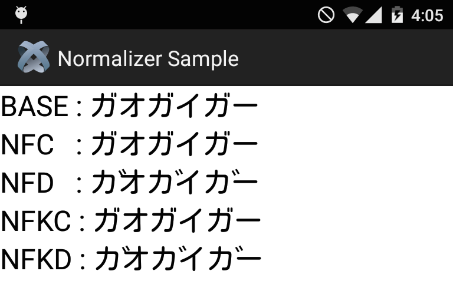

# TiTextNormalizer

Titanium unicode normalization module for Android

## API

### normalize(String, Form) : String

```javascript
var module = require('net.imthinker.ti.textnormalizer');
var text = 'ガオガイガー';
var nfc = module.normalize(text, module.NFC);
var nfd = module.normalize(text, module.NFD);
var nfkc = module.normalize(text, module.NFKC);
var nfkd = module.normalize(text, module.NFKD);
```

### isNormalized(String, Form) : Boolean

```javascript
var module = require('net.imthinker.ti.textnormalizer');
var text = 'ガオガイガー';
module.isNormalized(text, module.NFC); // true
module.isNormalized(text, module.NFD); // false
module.isNormalized(text, module.NFKC); // true
module.isNormalized(text, module.NFKD); // false
```

## Screenshot



## Distribution

See **releases** page

## Example

See `example/app.js`

## License

Apache License, Version 2.0

```text
Copyright 2014 Ryutaro Miyashita

Licensed under the Apache License, Version 2.0 (the "License");
you may not use this file except in compliance with the License.
You may obtain a copy of the License at

    http://www.apache.org/licenses/LICENSE-2.0

Unless required by applicable law or agreed to in writing, software
distributed under the License is distributed on an "AS IS" BASIS,
WITHOUT WARRANTIES OR CONDITIONS OF ANY KIND, either express or implied.
See the License for the specific language governing permissions and
limitations under the License.
```
